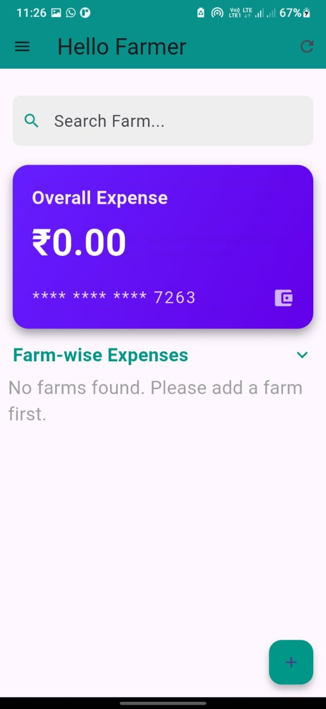

# 🧑‍🌾 Farmers Diary

**Farmers Diary** is a mini project built using **Flutter** that helps farmers manage their crop records, input schedules, and generate reports. The app offers a simple and user-friendly interface, developed with a focus on usability and offline access.

## 📱 Project Overview

Farmers Diary allows users to:
- Select crop types (Fruits, Vegetables, etc.)
- Create and manage multiple plots with start dates
- Add pesticide and fertilizer schedules
- Edit and track input usage (name, quantity, cost, remarks)
- Generate PDF summaries of crop activities

## 🧑‍💻 Tech Stack

- **Frontend**: Flutter (Dart)
- **Storage**: Local storage (Offline access)
- **PDF Generation**: PDF API
- **IDE**: Android Studio

## 📂 Features

- 🚜 Easy crop and plot management
- 📆 Schedule maintenance tasks for each plot
- 🧪 Record inputs like pesticides/fertilizers
- 📝 Edit or update schedules and inputs
- 📄 Generate a professional PDF summary report
- 📶 Fully functional offline using local storage

## 🔧 Configuration Process

To set up and run the project locally, follow these steps:

1. **Install Flutter SDK**  
   Download and install Flutter from the official site:  
   👉 https://flutter.dev/docs/get-started/install

2. **Clone the Repository**

<code>git clone https://github.com/your-username/farmers_diary.git</code>

<code>cd farmers_diary</code>

3. **Open in Android Studio or VS Code**
<code>Launch your preferred IDE and open the project folder.</code>

4. **Get Project Dependencies**
<code>flutter pub get</code>

5. **Run the App on Emulator or Device**
<code>flutter run</code>

6. **Generate PDF Report (Optional)**
If using a third-party plugin for PDF generation, ensure it's properly configured in pubspec.yaml:
<code>dependencies:
  pdf: ^3.10.4
  path_provider: ^2.0.11
</code>

7. **Build APK (Optional)**
<code>flutter build apk --release</code>

## 🖼️ Screenshots

Below are some key screens from the **Farmers Diary** app:

### 🏠 Home Screen

### 🌾 Add Farm Screen

### 💰 Add Expense Screen

### 📄 Report Screen

